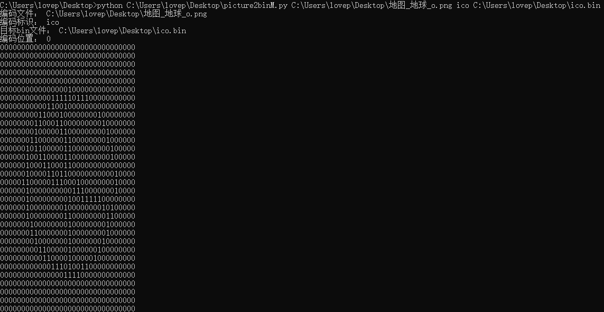
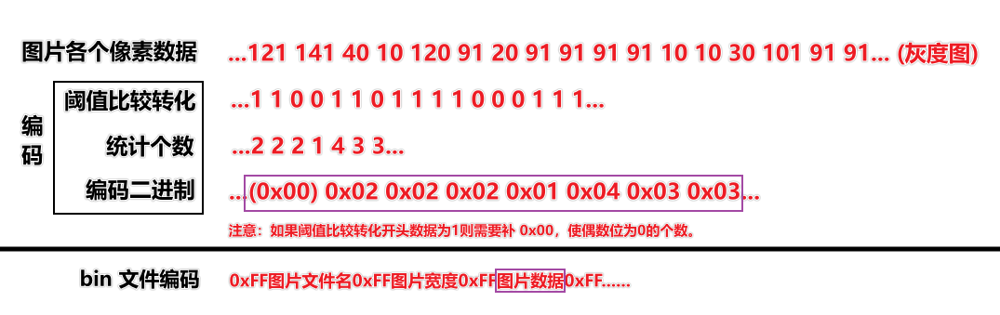
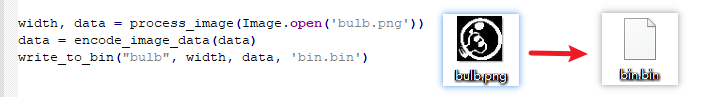
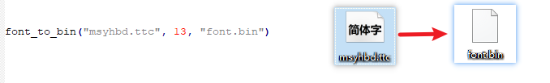
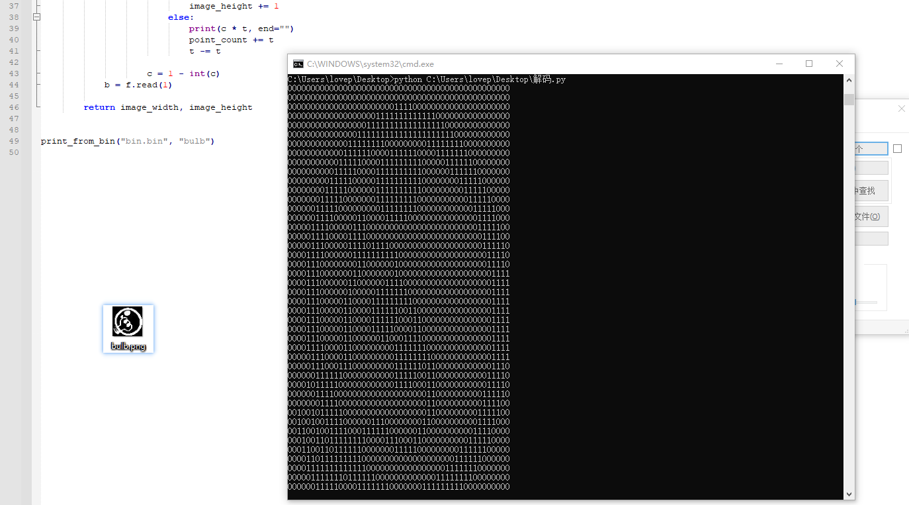
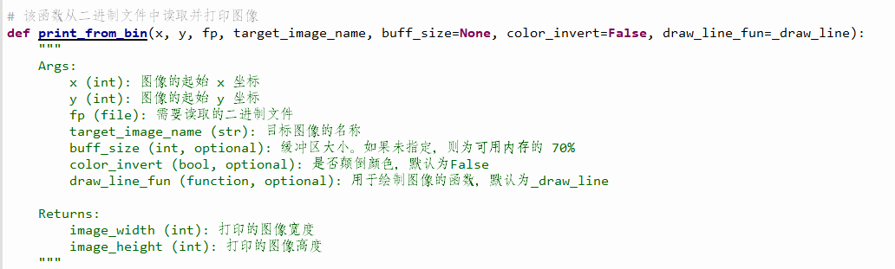
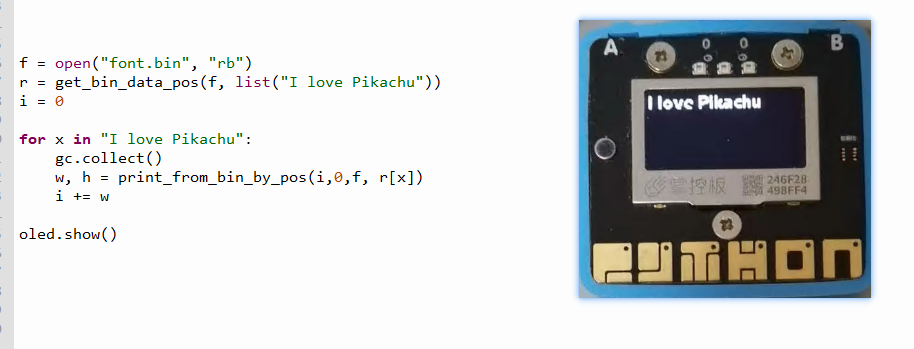

# New-mpython-BinToPicture

#### 介绍
一个在掌控板(esp32-mpython)上打印图片的方法，通过牺牲存储与时间换取尽可能少的运行空间，这个项目自定义了一个新的bin文件格式用于保存图片数据。仓库中有三个文件： `encode2bin.py` 、 `bin2decode.py` 和 `bin2picture.py` 。

其中 `bin2picture.py` 文件是给 mpython 用的，用于解码并打印 bin 文件中的图片数据。其余的两个文件是给电脑编码 bin 文件与测试用的。在介绍如何使用这三个文件之前，不妨请先了解一下bin文件的构成。

#### 简单用法

如果你只想知道如何生成一个bin文件，你可以使用我简单写的命令行py，`picture2binM.py`。使用方法为：`python picture2binM.py 图片名 标识名 bin文件名`

效果如下：



**注意：此压缩算法不支持透明图片，请把透明像素点去掉再使用**

#### 图片压缩算法（bin文件的构成）
此算法不同于传统图片压缩算法。此算法针对2色（1bit）图片（即只有黑、白两色的图片）。

1. 在程序处理时，会把一张彩色图片的的各个像素对比阈值大小编码为 `0`（小于阈值）或者 `1`（大于阈值），并记录图片的宽度，然后把各个编码后的像素放在一个数组中，进行二次编码。

2. 假设一张图片编码后数据为 `01001101100` 程序会统计连续出现的 0 或者 1 的个数。比如上述的数据会统计为 `1122122` 然后转化为二进制字节数据 `0x01 0x01 0x02 0x02 0x01 0x02 0x02`（这里用十六进制表示一个字节，下同）作为图片的最终编码数据。我们规定二进制字节数据的下标从 0 开始，偶数位（下标取余2为0的）规定为 `0` 的个数，奇数位（下标取余2为1的）规定为 `1` 的个数。如果一张图片编码数据为 `1011100` 统计结果为 `1132` ，但是其的二进制字节数据为 `0x00 0x01 0x01 0x03 0x02`（如果图片编码数据开头不是0，则需要添加一个 `0x00` 使偶数位为 `0` 的个数）。

3. 我们保留字节 `0xFF` 备用，假设一个图片中有超过连续 254 个 0 或 1，则需要截断，然后添加 `0x00` 继续编码。比如有连续的 255 个 1 （`...11111...`），编码为 `... 0xFE 0x00 0x01 ...`。总之一定要保持偶数位为 `0` 的个数，奇数位为 `1` 的个数。

4. bin文件是个多图片混合文件，其主要结构为：`0xFF` `图片1名称` `0xFF` `图片1宽度` `0xFF` `图片1数据` `0xFF` `图片2名称` `0xFF` `图片2宽度` `0xFF` `图片2数据` `0xFF` `...` 其中 `0xFF` 用于各个数据段的分隔符号。其中`图片名称`与`图片宽度`为 utf-8 编码格式的普通字符串。



#### 代码使用说明

+ 编码与测试代码使用

涉及两个源码： `encode2bin.py` 、 `bin2decode.py` 。这个两个是在计算机上（Python环境下）运行的。

你可以新建一个 Python 文件，并将上面两个文件作为模块导入使用，或者直接在源文件添加代码运行。

下面是用 `encode2bin.py` 添加一个图片文件到bin文件的示例。**图片文件最好是灰度图片。**

```python
width, data = process_image(Image.open('bulb.png'))
data = encode_image_data(data)
write_to_bin("bulb", width, data, 'bin.bin')
```



我们还尝试让 bin 文件容纳字体文件，不推荐这样做（因为在掌控板上很慢），但是我们保留了这个示例：

```python
font_to_bin("你的字体路径", 13, "font.bin")  # chs 参数允许你添加额外的字体
```



bin文件在电脑上测试解码可以采用 `bin2decode.py` ：

```python
print_from_bin("bin.bin", "bulb")
```



**在测试的时候，电脑上几乎瞬间输出图片文件，尤其对于遍历多图片的bin文件时。但是对于掌控板，图片越多的bin文件越慢，除非图片很快被定位，不然需要等上好几秒。**

+ 掌控板解码

`bin2picture.py` 是给掌控板使用的，在读取bin文件时，为了加快遍历文件速度，我在找寻的代码上加入了缓存区，缓存区的大小默认是可用运行内存的 0.2 倍，可能对于多线程不是很友好，你可以通过调整 `buff_size` 参数来控制缓存区大小。

将源码上传到掌控板，你可以使用模块导入的方式引用或者直接复制代码到你的程序中。下面是读取图片的示例：

```python
f = open("bin.bin", "rb")
print_from_bin(0,0,f,"bulb")
oled.show()
```


对于 `print_from_bin` 函数的参数，代码中已经标注的很明白了。



当然，你也可以拿来打印字体，但是我们不建议这样做，这样只会让掌控板运行速度更慢。

```python
f = open("font.bin", "rb")
r = get_bin_data_pos(f, list("I love Pikachu"))
i = 0

for x in "I love Pikachu":
    gc.collect()
    w, h = print_from_bin_by_pos(i,0,f, r[x])
    i += w

oled.show()
```



最后函数会调用 `gc.collect()` 来回收函数产生的内存冗余。


